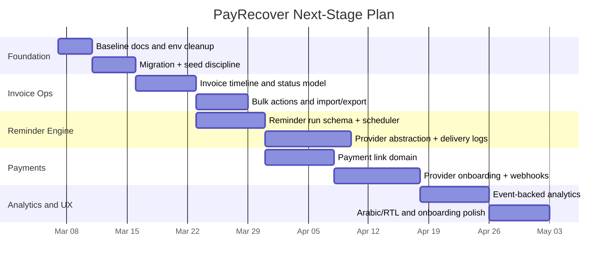

# PayRecover Implementation Plan

## 1. Delivery Strategy

Build the next stage as a sequence of small, production-safe expansions around the current modular monolith. Do not split the codebase into microservices yet. First make the existing user journey complete, then automate delivery, then monetize through payments and analytics.

## 2. Workstreams

### Workstream A: Product foundation hardening

- Replace stale template config/docs with product-accurate documentation
- Normalize environment config
- Add seed/dev data strategy
- Add database migration discipline and rollback notes

### Workstream B: Invoice operations

- Add invoice detail page or drawer
- Add overdue aging and due-date derived status handling
- Add bulk operations and CSV import
- Add event history for every invoice mutation

### Workstream C: Reminder execution

- Introduce scheduled reminder runs
- Add delivery log tables
- Integrate WATI for WhatsApp template delivery and message-status webhooks
- Add retry and suppression rules

### Workstream D: Payments

- Introduce payment account and payment link models
- Generate Paymob invoice payment links / checkout sessions
- Add Paymob callback handlers, HMAC verification, and reconciliation
- Auto-close reminders when payment succeeds

### Workstream E: Analytics and retention

- Persist delivery and payment events
- Build event-backed dashboards
- Add onboarding checklist and value-discovery surfaces
- Add localization, business templates, and plan packaging

## 3. Suggested Build Order

## 4. Phase Details

### Phase 1: Close the MVP workflow gap

Outcome:
- the current product can manage invoices cleanly and reflect real operational states

Deliver:
- invoice aging logic
- invoice activity timeline
- local export/import
- better empty/error states
- updated docs and setup clarity

Exit criteria:
- a user can create, edit, search, filter, update, and delete invoices with confidence
- dashboard metrics remain consistent with invoice state

### Phase 2: Make reminders executable

Outcome:
- reminder templates become a real automation engine

Deliver:
- scheduler trigger model
- reminder run table
- delivery attempt log
- WATI delivery adapter and webhook ingestion
- paused/suppressed/failed states

Exit criteria:
- reminder lifecycle is observable end to end
- failed sends are traceable

### Phase 3: Turn recovery into collection

Outcome:
- invoices become payable through linked payment providers

Deliver:
- Paymob checkout / payment-link flow
- Paymob provider onboarding
- Paymob callback + HMAC verification
- invoice reconciliation
- payment event history

Exit criteria:
- successful payment updates invoice state automatically
- payment failures and retries are visible

### Phase 4: Differentiate with analytics and localization

Outcome:
- product becomes meaningfully better for MENA SMB operations

Deliver:
- Arabic/RTL
- localized templates and currencies
- event-backed analytics
- vertical starter kits for clinics, gyms, and coaches

Exit criteria:
- a new user can onboard in their region/language and see operational metrics that are based on real events

## 5. Engineering Guardrails

- keep route-level auth and tenant scoping on every mutable endpoint
- add unit and integration coverage with each business rule change
- keep Paymob and WATI behind ports/adapters
- add webhook idempotency before going live
- add structured logs for every outbound WATI delivery and Paymob callback

## 6. Recommended Immediate Backlog

1. Replace synthetic dashboard trend logic with a truthful placeholder until historical events exist.
2. Add invoice event history tables and UI.
3. Add due-date-based status recalculation.
4. Model WATI reminder execution entities before integrating delivery endpoints.
5. Add Paymob payment-link domain before exposing live provider actions in settings.
6. Add localization architecture before expanding UI copy.
