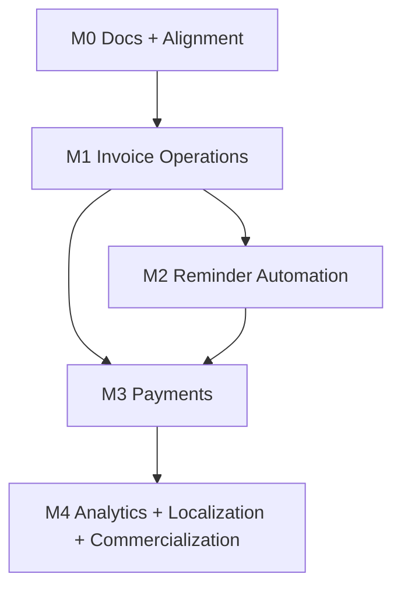

# PayRecover Milestones

## Milestone Overview

| Milestone | Goal | Main deliverables | Exit signal |
| --- | --- | --- | --- |
| M0 | Documentation and foundation alignment | Updated README, architecture/spec/plan docs, environment cleanup | Team can onboard from docs without guesswork |
| M1 | Operational invoice workspace | Invoice timeline, aging logic, bulk actions, truthful dashboard states | Users can manage collections work daily |
| M2 | Live reminder automation | Scheduler, reminder runs, delivery logs, provider abstraction | A reminder can be scheduled, sent, and tracked |
| M3 | Payment recovery loop | Payment links, provider onboarding, webhook reconciliation | Reminder-to-payment flow works end to end |
| M4 | Product expansion | Analytics, localization, vertical kits, plan packaging | Product is region-aware and commercially differentiated |

## Milestone Details

### M0: Documentation and architecture alignment

Deliverables:

- current-state architecture documentation
- end-to-end user flow documentation
- product spec
- implementation plan
- milestone map
- ADR for keeping the modular monolith architecture

Acceptance:

- repo docs describe the actual codebase
- current gaps are explicit

### M1: Operational invoice workspace

Deliverables:

- invoice event history
- aging buckets and due-date derived status
- bulk mark-paid / archive / export actions
- invoice detail drawer or dedicated page
- import path for existing customer lists

Acceptance:

- collections work no longer depends on hidden row state and menu-only actions
- overdue and due-soon logic is deterministic

### M2: Live reminder automation

Deliverables:

- reminder execution schema
- scheduled reminder jobs
- WATI delivery attempt logs
- pause, retry, and suppression logic
- WATI provider configuration state

Acceptance:

- the product can explain what was scheduled, what was sent, and what failed

### M3: Payment recovery loop

Deliverables:

- Paymob account/config model
- Paymob invoice payment links / checkout intents
- Paymob payment callbacks
- invoice reconciliation rules
- reminder suppression after payment

Acceptance:

- invoice payment state updates without manual intervention
- Paymob callbacks are auditable and idempotent

### M4: Analytics, localization, and commercialization

Deliverables:

- Arabic/RTL support
- event-backed analytics
- business-type onboarding presets
- pricing and entitlement model
- team access groundwork

Acceptance:

- product feels intentionally built for MENA SMB operators
- product analytics show operational and commercial health

## Dependency Map

