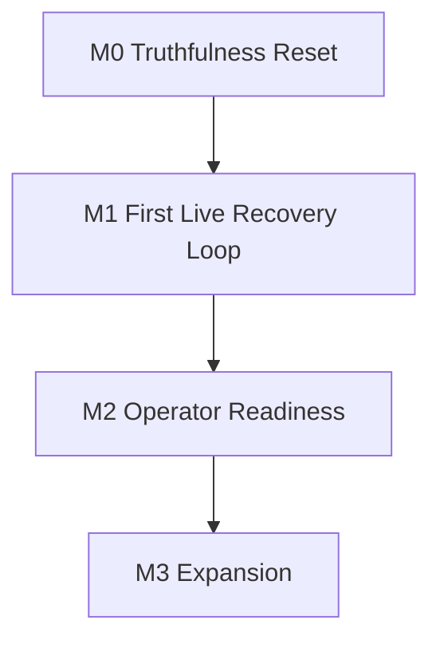

# PayRecover Milestones

## Milestone Overview

| Milestone | Goal | Main deliverables | Exit signal |
| --- | --- | --- | --- |
| M0 | Truthfulness reset | Remove fake UI/actions, align docs, clarify product boundary | Product copy matches actual behavior |
| M1 | First live recovery loop | Tenant-owned WATI + Paymob onboarding, payment links, reminder dispatch, webhook reconciliation, suppression | One invoice can move from unpaid to paid end to end |
| M2 | Operator readiness | Failure handling, persisted notifications, import/bulk workflows, event-backed visibility | Small businesses can run daily collections work in the app |
| M3 | Expansion | Additional providers, localized onboarding, deeper analytics | Product grows without losing its collections-first focus |

## Milestone Details

### M0: Truthfulness reset

Deliverables:

- remove dead or fake links and labels
- make settings/invoice/reminder copy reflect real product state
- align README and architecture docs with tenant-owned provider strategy

Acceptance:

- no major UI surface implies a live behavior that does not exist
- repo docs describe the current codebase accurately

### M1: First live recovery loop

Deliverables:

- WATI messaging connection onboarding
- Paymob payment connection onboarding
- one active primary payment link per invoice/provider connection
- reminder-run materialization and cron dispatch
- delivery attempts and callback ingestion
- verified payment reconciliation and reminder suppression
- auditable invoice timeline

Acceptance:

- payment truth comes from validated provider events or manual mark-paid actions
- future reminder runs are suppressed after confirmed payment
- existing unpaid invoices become operational after provider verification

### M2: Operator readiness

Deliverables:

- failed-send and failed-payment operator states
- import/bulk collections workflows
- event-backed dashboard metrics
- provider onboarding guidance and health visibility

Acceptance:

- an operator can identify what needs action without reading logs
- dashboard metrics reflect stored events instead of aggregate snapshots only

### M3: Expansion

Deliverables:

- second-provider support where commercially justified
- localization and Arabic/RTL improvements
- deeper recovery analytics
- onboarding presets by business type

Acceptance:

- growth does not force PayRecover into shared provider infrastructure or ERP scope

## Dependency Map

