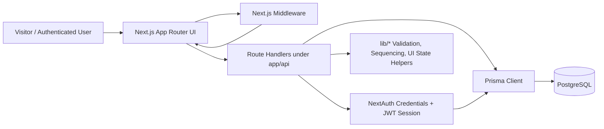
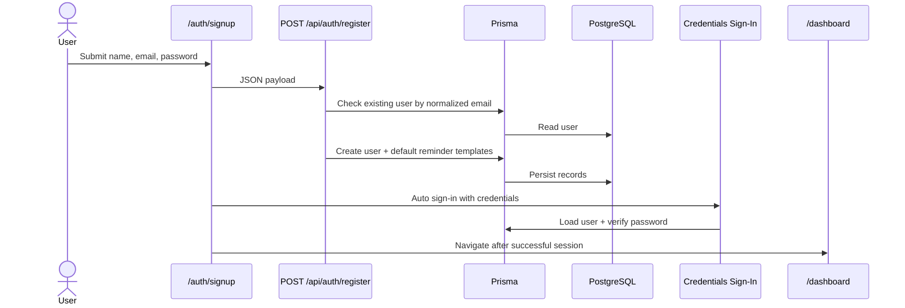
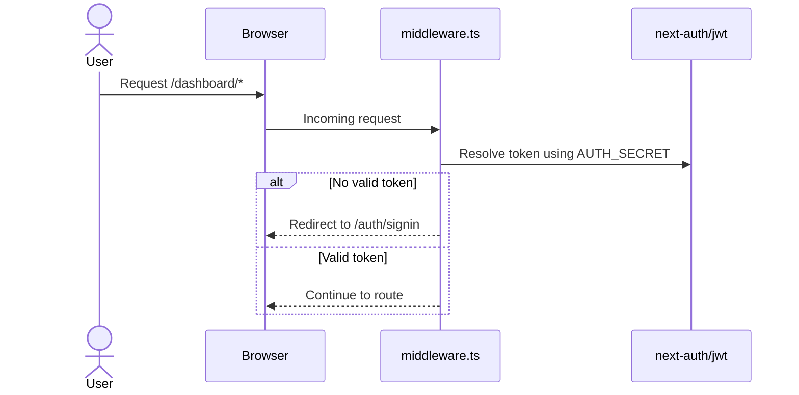
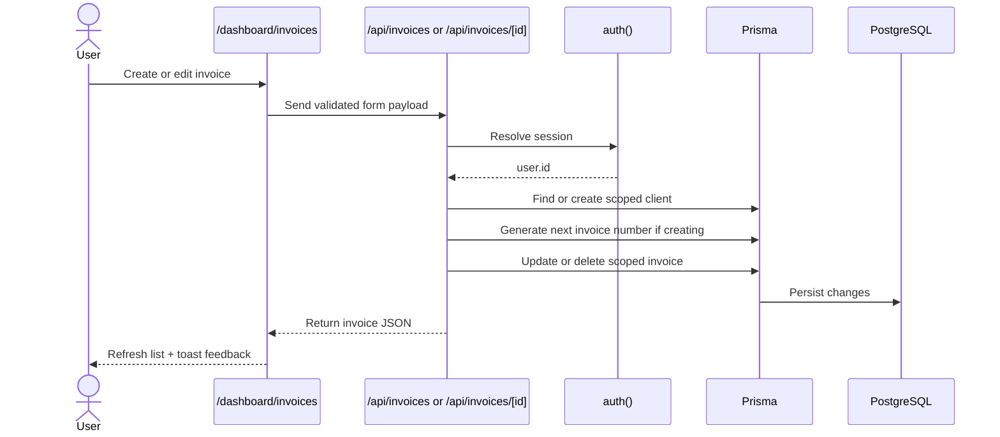
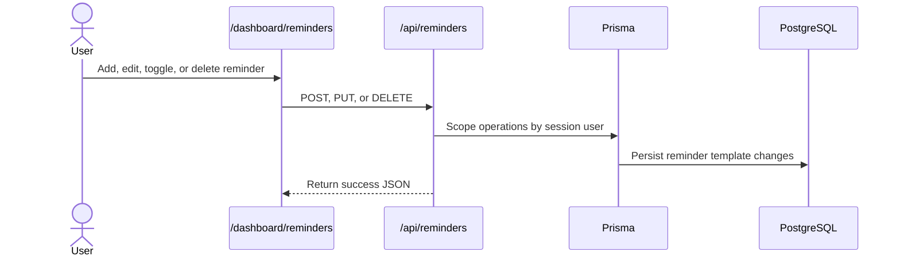
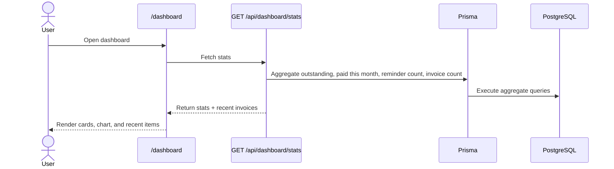

# PayRecover System Architecture

## 1. Purpose

PayRecover is currently implemented as a modular monolith focused on one business problem: helping a business owner track unpaid invoices and prepare reminder sequences that can later be connected to WhatsApp, SMS, and payment providers.

## 2. What Exists Today

### User-facing surfaces

- Landing page for positioning and pricing
- Sign-up and sign-in flows
- Protected dashboard
- Overview page with aggregated financial stats
- Invoices workspace
- Reminder automation workspace
- Settings workspace

### Core entities

- `User`
- `Client`
- `Invoice`
- `ReminderTemplate`
- `Account`, `Session`, `VerificationToken` from NextAuth

### Core business rules already implemented

- Every business record is scoped to `session.user.id`
- Sign-up seeds four default reminder templates
- Invoices are generated with a per-user sequential `INV-YYYY-NNN` number
- Client records are reused by `userId + phone`
- Invoice status can be `pending`, `overdue`, or `paid`
- Marking an invoice as `paid` sets `paidAt`
- Dashboard stats aggregate outstanding, paid-this-month, active reminders, and total invoices

## 3. Runtime Architecture

## 4. Module Boundaries

| Layer | Current responsibility | Main files |
| --- | --- | --- |
| Presentation | Pages, layouts, client-side state, forms, loading/error UX | `app/**`, `app/components/**` |
| Delivery/API | Auth, validation, CRUD route handlers, response shaping | `app/api/**` |
| Application helpers | Validation, invoice numbering, auth redirect logic, client fetch wrapper | `lib/**` |
| Persistence | Prisma client and schema | `lib/prisma.ts`, `prisma/schema.prisma` |
| Security gate | Redirect unauthenticated users away from dashboard routes | `middleware.ts`, `lib/middleware-auth.ts` |
| Quality layer | Unit and integration tests | `tests/**` |

## 5. End-to-End Flows

### 5.1 Sign-up and first dashboard access

### 5.2 Auth enforcement

### 5.3 Invoice create/edit/pay/delete flow

### 5.4 Reminder sequence management

### 5.5 Dashboard overview load

## 6. Business Flow Summary

1. A business owner creates an account.
2. The system seeds a starter reminder sequence.
3. The owner creates client-linked invoices.
4. The owner monitors outstanding balances and paid invoices.
5. The owner configures reminder timing and templates.
6. The owner updates business profile data that will later feed outbound communication and payment-link flows.

Today, the product stops at workflow preparation and internal tracking. It does not yet execute live reminder delivery or payment collection.

## 7. Current Strengths

- Clear tenant isolation in route handlers
- Consistent input validation and normalized error responses
- Good MVP coverage for auth, invoices, reminders, settings, and helper logic
- UI already supports loading states, retry states, toasts, dialogs, and mobile sidebar navigation
- Prisma schema is small and understandable

## 8. Current Gaps and Architectural Debt

### Product gaps

- Reminder templates are stored, but no scheduler sends them
- Payment gateway cards exist in UI, but there is no onboarding or payment-link generation
- WhatsApp delivery is explicitly marked "Coming soon"
- Dashboard trend chart is synthetic, not backed by historical event data
- Notification preferences are local component state only

### Data model gaps

- No payment transaction model
- No delivery log / message event model
- No invoice event history
- No role/team model for multi-user businesses

### Operational gaps

- No queue or worker layer for scheduled sends
- No webhook receiver for provider callbacks
- No observability pipeline for outbound delivery, payment conversion, or failures
- No background reconciliation jobs

## 9. Recommended Next Architecture Step

Keep the current modular monolith for the next stage, but add a dedicated automation and payments domain around it:

- `payment_accounts`, `payment_links`, `payment_events`
- `reminder_runs`, `message_deliveries`, `delivery_attempts`
- a scheduler/worker boundary for time-based execution
- webhook endpoints for payment and messaging providers
- analytics tables based on actual events instead of derived estimates
